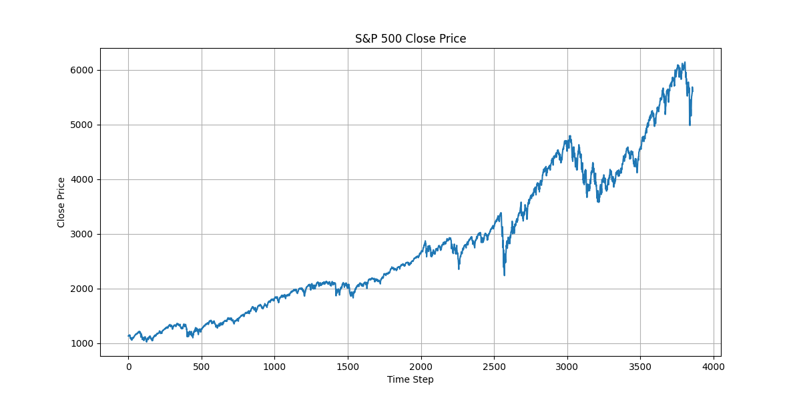
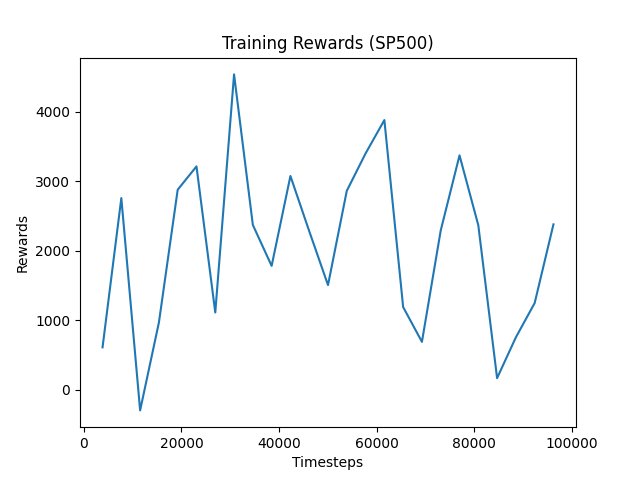
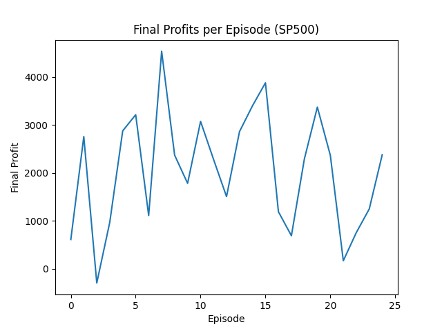
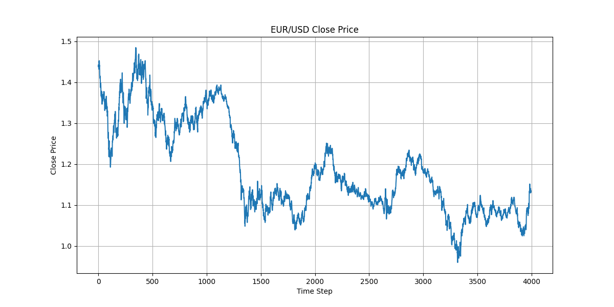
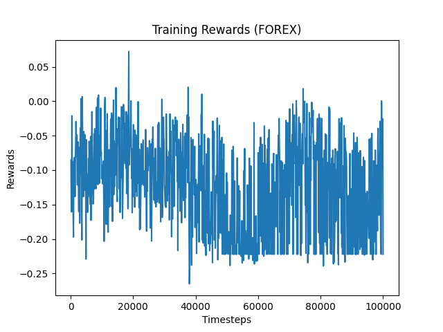

# Reinforcement Learning for S&P 500 and Forex (EUR/USD) Trading

## Introduction
This project demonstrates the application of reinforcement learning (RL) to financial trading. We train RL agents to trade the S&P 500 index and the EUR/USD forex pair using historical price data, aiming to explore the challenges and insights of RL in real-world markets.

## Data Collection
We use the `yfinance` library to fetch historical daily data:

- **S&P 500:** `^GSPC` (2010–present)
- **Forex:** `EURUSD=X` (2010–present)

To download the data, run:
```bash
python src/data_collection.py
```

## Environment
A custom OpenAI Gymnasium environment simulates trading episodes:

- **State:** Window of past N normalized prices, current balance, and shares held.
- **Actions:** 0 = Hold, 1 = Buy (if not already holding), 2 = Sell (if holding).
- **Reward:** Realized profit/loss when a position is closed (on sell or forced liquidation at episode end).
- **Exploration:** To ensure the agent experiences trading, the environment forces an initial buy at the start of each episode.

## RL Agent
We use Stable Baselines3's DQN agent:

```python
from stable_baselines3 import DQN
model = DQN('MlpPolicy', env, verbose=1)
model.learn(total_timesteps=10000)
model.save("sp500_dqn_agent")
```

Train with:
```bash
python src/train_agent.py
```

## Results

### S&P 500
- **Price behavior:** Mostly upward-trending (bull market).
- **Agent behavior:** Learned to hold, resulting in a steadily increasing reward and profit curve.
- **Key finding:** In a long-term bull market, "buy and hold" is optimal, so RL does not learn a sophisticated policy.
- **Total Profit:** Positive, but primarily due to market drift, not trading skill.

**Figure 1: S&P 500 Price Movement**  
Daily closing prices for the S&P 500 over the training period.



**Figure 2: S&P 500 Training Reward per Episode**  
Total realized profit/loss (reward) per episode during training. In this environment, the training reward is equal to the final profit per episode.



**Figure 3: S&P 500 Final Profits per Episode**  
Final profit at the end of each episode. (Identical to training reward due to reward structure.)



### Forex (EUR/USD)
- **Price behavior:** No strong long-term trend, more volatility.
- **Agent behavior:** After modifying the reward to only realized profit/loss and forcing an initial buy, the agent made more trades but still failed to learn a profitable strategy.
- **Key finding:** Even with more exploration and forced trading, the agent failed to learn a profitable trading strategy, highlighting the challenge of RL in financial markets with simple state and reward structures.
- **Total Profit:** Near zero
- **Total Trades:** Low

**Figure 4: EUR/USD Price Movement**  
Daily closing prices for the EUR/USD forex pair over the training period.



**Figure 5: Forex Training Reward per Episode**  
Total realized profit/loss (reward) per episode during training. As with S&P 500, this is equal to the final profit per episode.



**Figure 6: Forex Final Profits per Episode**  
Final profit at the end of each episode. (Identical to training reward due to reward structure.)


## Discussion & Lessons Learned
- RL agents can struggle to learn meaningful trading policies in real-world financial data, especially with simple state spaces and reward structures.
- In trending markets, "buy and hold" dominates; in mean-reverting or volatile markets, the agent may not learn to time trades without more informative features.
- Reward shaping, richer observations, and more advanced RL algorithms may be needed for better performance.
- Forcing initial trades and increasing exploration can help the agent experience trading, but may not be sufficient for learning profitable strategies.
- In this setup, training reward and final profit per episode are identical because rewards are only given on realized profit/loss at the end of each episode.

## Conclusion
This project highlights both the promise and the challenges of applying RL to financial trading. While RL can, in theory, learn to trade, practical success requires careful environment design, feature engineering, and reward shaping. Future work could include adding technical indicators, allowing shorting, or using more advanced RL methods. 